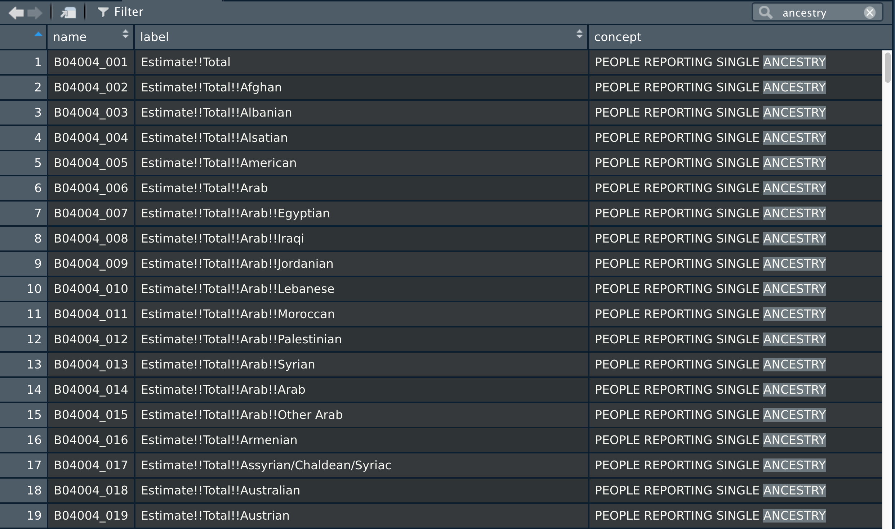

```{r setup, include=FALSE, message=FALSE}
knitr::opts_chunk$set(echo = TRUE)
knitr::opts_chunk$set(message = FALSE)
```

Data from the US Census Bureau can be invaluable resources for doing research. The enormous scale of Census data (both breadth over time and depth from options!) can be overwhelming, so this tutorial is intended to guide students to using Census Data in R. Although it is possible to manually download data from the Census (if you would prefer to do that, see the note below), we focus on doing so programatically because it has several benefits. By using Census data in R:

1. Your work will be **editable.** As projects progress, your interests will inevitably develop and change. By writing code to request Census data, you can update your analysis to match your new interests by editing a few lines to designate which data sources you want. If instead you collect data manually, you would have to repeat the entire process each time you wish to update your focus. Like learning any new skill, the startup cost may concern you and make it seem like downloading data manually from the website will be easier. This tutorial is intended to make that startup cost as low as possible for you!
2. Your work will also be **reproducible**. If some future researcher (or you!) wants to replicate your work, they will be able to rerun a script instead of manually searching through the Census website to try to find the exact file as you.
3. Your analysis **can happen all in one place**. The more you practice any skill, the better you will become. With R, you can download Census data, analyze it, and visualize your results all in one environment. Very convenient!

**Before we begin**: if you would prefer not to use R and would rather download data manually, then you may be interested in exploring the [offical Census tutorials on working with their data](https://www.census.gov/data/academy.html). They focus on [manually downloading](https://www.census.gov/data/what-is-data-census-gov/guidance-for-data-users/video-tutorials.html) directly from their [data.census.gov](https://data.census.gov/) portal. 

## What source to use?

The first hurdle we must pass is **knowing what data you are looking for.** On their website, the US Census Bureau states that their mission is "...to serve as the nation's leading provider of quality data about its people and economy." As a result, they have an astonishing amount of information that is available to you. The screenshot below shows some of the various sources offered by the Census Bureau, many of which you may have heard of:

```{r, echo=FALSE, fig.align="center", fig.cap="***List of Census Surveys and Programs - a lot to work with!***"}

```

Here, we will focus on the two most popular Census products - the Decennial Census and the American Community Survey (ACS). Much more detail about the differences between the two [can be found here](https://www.census.gov/programs-surveys/acs/about/acs-and-census.html), but the core differences are:

- The **Decennial Census** is conducted once every ten years and aims to count ("enumerate") every person in the United States. It focuses on questions of population, age, sex, race, ethnicity, and residential status.
- The **American Community Survey** is conducted on a smaller sample (generally about 3-4 million) and focuses on more specific demographic information. Here, they ask questions about education, employment status, transportation habits, etc. Data are released in versions called 1, 3, or 5 "Year Estimates," which means multiple years of the ACS can be combined for each estimate. So, 1 year estimates may be most up to date but the least accurate, while 5 year estimates will be more accurate but in part include data from 5 years before your year of interest.

We will learn how to look in much more detail at each release below, but in general the Decennial Census is the best source of general population data (counts by area, racial group, etc.) but may be a little old (though, this will not be a problem for at least a few years with the updated 2020 Census), while the ACS provides more estimated information for a wider variety of demographic topics.

## What area to focus on?

All Census releases have data available at a wide variety of geographies. This graphic, from the [Missouri Census Data Center](https://mcdc.missouri.edu/geography/sumlevs/), summarizes the geographic levels at which you can get data. The Decennial Census is available down to the Census Block level (generally comparable to a city block in urban areas, but can be geographically larger in rural areas -- normally representing a few dozen or hundred people), while the ACS is available down to the block group level (combinations of adjacent blocks). Much more detail on each of these geographies is available at [this link](https://mcdc.missouri.edu/geography/sumlevs/).

```{r, echo=FALSE, fig.align="center", fig.height=8, fig.width=8, fig.cap="***Diagram of Census geographic levels.***"}
knitr::include_graphics("figs/geo_levels.png")
```

## Which variables to request?

Both the Decennial Census and the ACS have a wide variety of information (called "variables" you can request). You can see variables manually by searching them on [data.census.gov](https://data.census.gov/cedsci/), but the `R` package `tidycensus` offers a more systematic way to do this.

The first step is to request a Census API Key. An API is a set of functions that allow you to interact with the Census system that gives you the data you request, and an API Key is like a password that grants you access. To do so, visit [this link](https://api.census.gov/data/key_signup.html) and enter your information. They will send you a password with a private key. Save it somewhere safe!

Then, we need the `tidycensus` package. If you have never used it before, you should run `install.packages("tidycensus")` once to install it. Once that is complete, load the `tidycensus` (and `tidyverse` packages, which you should install if you don't have it). 

```{r}
library(tidyverse)
library(tidycensus)
```

Then, we use the `tidycensus` function `census_api_key()` to "login" to the Census. You should run this one time (ever! Your R will remember the password) by pasting this code into the console:

```{r, eval=FALSE}
census_api_key("PASTE YOUR API KEY FROM THE EMAIL HERE", install = TRUE)
```

To see the variables available to you in a particular survey, you can use the `load_variables()` function. The function takes arguments for the year you are interested in, the survey (Census or ACS). You can also find these lists on the [Census website](https://www.census.gov/data/developers/data-sets/acs-5year.html) (on individual pages for each survey like [this for the 2019 ACS](https://api.census.gov/data/2019/acs/acs5/variables.html). Let's look at all available variables from the ACS 2018 5-year estimates:

```{r}
# the cache = TRUE argument store the value on your computer,
# which will make it run much faster next time you use it.
acs2018 <- load_variables("2018", "acs5", cache = TRUE)
```

This stores a datset of available variables as a `tibble` in R (a type of data frame). You can easily explore it by running the `View()` function on the object, which will open a new window where you can search through all of the available variables (or type in a phrase next to the magnifiying glass to find something of interest to you). In these examples, the `name` column lists an ID code for the variable (this is what we will use to request), along with a descriptive `label` (the Census uses !! symbols to indicate levels, so Estimate!!Total!!Male means the number of males), and `concept` gives more detail about the question. You can search through these objects to choose whatever variables you want to work with.

```{r, echo=FALSE, fig.align="center", fig.cap="***Example ACS columns.***"}

```

```{r, echo=FALSE, fig.align="center", fig.cap="***Using the RStudio search option in View to search for variables related to ancestry.***"}

```

## How do I request a variable?

The Census (as with all APIs) bases data by "requests." Basically, you ask the Census nicely for specific data in a format that they offer, and they will return to you a dataset. THe `tidycensus` package deals with cleaning and presenting this data in R nicely for you. The functions `get_decennial()` and `get_acs()` are how you request data from each of the surveys we discussed above. The most important arguments are the `year` you want, the `geography` (according to the levels in the diagram above), and the `variable` (using the ID code we found in the previous section). It is also tempting with any Census data to visualize it on a map, so we will also set the argument `geometry = TRUE` to ask for spatial data as well. You can see a full list of arguments to (this or any other) function by running `?get_acs` in the console. For example, let's request the number of Dutch people in every New Jersey county in 2017:

```{r, results="hide"}
# B04004_034 = Estimate!!Total!!Dutch
dutch <- get_acs(geography = "county", state = "NJ", 
                 variables = "B04004_034", year = 2017, geometry = TRUE)
```

```{r}
head(dutch)
```

The function may print out some progress messages to let you know it is working, and if you receive data back in the object you know that it worked.

## How do I map it?

As described above, a big benefit of loading Census data directly from R is that you immediately start to analyze and visualize it without any further work or cleaning. Here, let's use the `sf` package to make a simple map of our requested variables. This is possible because we asked for the map information with `geometry = TRUE`.

```{r}
library(sf)

p1 <- dutch %>% 
  ggplot() + 
  geom_sf(aes(fill = estimate)) + 
  # Code below is just minor visual editing, not necessary for the map to run!
  ggthemes::theme_map() + 
  theme(legend.position = "right") + 
  scale_fill_gradient2(name = "Dutch Population", 
                       low = "white", 
                       high = "orange")

p1
```

If you have experience working with demographic data, you may be thinking that maps of raw population counts often just reflect population density. For example, our map above may just reflect that there are more people overall in northern New Jersey, not necessarily that the proportion of the population that is Dutch is particularly high. 

That's why people will often **normalize** Census data by turning raw counts into some proportion of people in the area. For example, here we could plot the **proportion** of people in a given county who identified as Dutch. We would do that by dividing our same variable above by the total population in that area. This pattern is so common that `tidycensus` has a built-in option for it with the `summary_var` argument, which will add a new column onto our dataset with the column we would like to normalize by. 

If we open `acs2018` back up again, we can see that the total number of people who reported their ancestry is given by the `B04004_001` column, so this is what we will include as a summary variable:

```{r, results="hide"}
dutch_prop <- get_acs(geography = "county", state = "NJ", 
                 variables = "B04004_034", summary_var = "B04004_001",
                 year = 2017, geometry = TRUE)
```

```{r}
head(dutch_prop)
```

Now, we see that the `estimate` column gives us the number of people who reported Dutch people, while the `summary_est` column reports the number of people who reported ancestry at all. The `moe` columns are the margin of error, which give an indication of how accurate the ACS thinks these estimates are. 

Let's use these columns above to calculate the proportion of each county in NJ that is Dutch (according to the 2018 ACS 5-year estimates). We will use `tidyverse` functions to do this. If you'd like an introduction or review of using `tidyverse` to work with data in R, I'd recommend [these introductory materials](https://github.com/tylersimko/intro-data-science) or [this free book](https://r4ds.had.co.nz/) by the creator of `tidyverse` for a more advanced look.

```{r}
# Calculate the proportion of people who identify as Dutch
  # Divide Dutch # by total

p2 <- dutch_prop %>% 
  # I rename the columns for clarity, this is not necessary 
  rename(dutch = estimate,
         total = summary_est) %>% 
  mutate(prop = dutch / total) %>% 
  ggplot() + 
  geom_sf(aes(fill = prop)) + 
  # Code below is just minor visual editing, not necessary for the map to run!
  ggthemes::theme_map() + 
  theme(legend.position = "right") + 
  scale_fill_gradient2(name = "Dutch Population", 
                       low = "white", 
                       high = "orange",
                       labels = scales::percent)

p2
```

